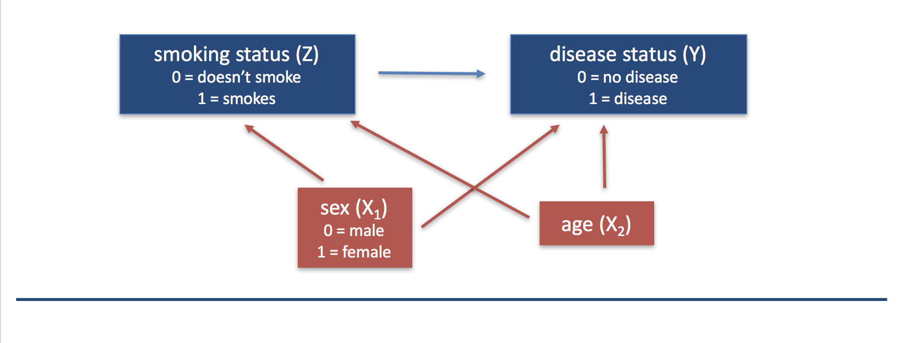

```{r setup, include=FALSE}
knitr::opts_chunk$set(echo = TRUE, message = FALSE)
knitr::opts_knit$set(root.dir = "/cloud/project")
```

## Preliminaries

First we load the packages that we will be using in this document.  It's good practices to load packages as the beginning so they are all in the same place.  If you decide later you need an additional package, add it to the top of the document!
```{r}
library(tidyverse)  # core group of tidyverse packages
```

## Module 1: Smoking and the risk of disease

Questions of interest:

* **Question 1.1: ** How does the risk of disease compare for smokers and otherwise similar non-smokers?

<center>
{width=500px}
</center>

* **Queston 1.2: ** Does the contribution of smoking to the risk of disease vary by sex or socio-economic status (SES)?

<center>
{width=500px}
</center>

To address each question we want:

* A data display (graph or table)
* A statistical analysis (with interprepration)

We will answer these questions using data from the National Medical Expenditures Survey (NMES)

## Discussion of NMES data displays for Question 1-1

In your breakout groups, take 15 minutes to discuss the following 5 displays.  For each display, answer the following questions:

* Does this display effectively answer our question on interest: *How does the risk of disease compare for smokers and otherwise similar non-smokers?*
     * Does it clearly show the risk of disease?
     * Does it allow you to easily compare smokers to non-smokers? Why or why not?
     * Does it account for "otherwise similar"? Why or why not?
     * What would your answer to the question be based on this display?  Does this answer match your intuition?
* How can the display be improved to more clearly answer our question of interest?
* What is something that you like about the display?

### Display 1

```{r echo = FALSE}
nmes_data <- read_csv("module_1/nmesUNPROC.csv")

nmes_data <- nmes_data %>%
  mutate(eversmk = factor(eversmk, levels = c("0", "1"), labels = c("Never smoker", "Ever smoker")),
         lc5 = factor(lc5, levels = c("0", "1"), labels = c("No LC", "LC")),
         female = factor(female, levels = c("0", "1"), labels = c("Female", "Male")),
         educate = factor(educate, levels = c("1", "2", "3", "4"), labels = c("College Graduate", "Some College", "HS Grad", "Other"))
         )

ggplot(data = nmes_data) + 
  geom_bar(mapping = aes(x = lc5, fill = eversmk), position = "fill") +
  facet_grid(female ~ educate) +
 labs(title = "Lung Cancer by Smoking Status",
       subtitle = "Stratified by sex and education",
       x = "Lung Cancer (LC)",
       y = "Proportion",
       fill = "Smoking Status"
       ) +
  theme(legend.position = "bottom")

```

### Display 2

```{r echo = FALSE}
nmes_data <- read_csv("module_1/nmesUNPROC.csv")

breaks = c(0, 55, 75, 120)
tags = c("0-54", "55-74", "75+")
nmes_data <- nmes_data %>%
  mutate(eversmk = factor(eversmk, levels = c("0", "1"), labels = c("Never smoker", "Ever smoker")),
         mscd = lc5+chd5,
         mscd = factor(mscd, levels = c("0", "1", "2"), labels = c("No Disease", "Disease", "Disease")),
         poor = factor(poor, levels = c("0", "1"), labels = c("Not Poor", "Poor")),
         age = as.numeric(age)
  )
agegroup = cut(nmes_data$age, breaks=breaks, labels=tags)
newdata = cbind(nmes_data, agegroup)

ggplot(data=newdata) + 
  geom_bar(mapping=aes(x=eversmk, y= stat(prop), group = mscd, fill=mscd), position = 'fill') + facet_grid(poor~agegroup)

```


### Display 3

```{r echo = FALSE}
nmes_data <- read_csv("module_1/nmesUNPROC.csv")

#Thought it would be nice to replicate the ageCat we did in Biostats, since older people tend to have more diseases overall.
nmes_data <- nmes_data %>%
  mutate(ageCat = case_when(
  age >= 65 & age < 99 ~ '3',
  age >= 40 & age < 65 ~ '2',
  age >= 0 & age < 40 ~ '1'))


nmes_data <- nmes_data %>%
  mutate(eversmk = factor(eversmk, levels = c("0", "1"), labels = c("Never smoker", "Ever smoker")),
         lc5 = factor(lc5, levels = c("0", "1"), labels = c("No LC", "LC")),
         ageCat = factor(ageCat, levels = c("1", "2", "3"), labels = c("[0,40)", "[40, 65)", "[65,99)")),
         poor = factor(poor, levels = c("1", "0"), labels = c("Poor", "Not Poor"))
         )

ggplot(data = nmes_data) + 
  geom_bar(mapping = aes(x = eversmk, fill = lc5), position = "fill") +
  facet_wrap(poor ~ ageCat) +
  labs(title = "Risk of disease by smoking status",
       subtitle = "Stratified by age group and poverty status",
       x ="Smoking status",
       y = "Risk of LC")
```

### Display 4

```{r echo = FALSE}
nmes_data <- read_csv("module_1/nmesUNPROC.csv")

nmes_data <- nmes_data %>%
  mutate(eversmk = factor(eversmk, levels = c("0", "1"), labels = c("Never smoker", "Ever smoker")),
         lc5 = factor(lc5, levels = c("0", "1"), labels = c("No LC", "LC"))
         )

nmes_table <- nmes_data %>%
  count(lc5, eversmk) %>%
  group_by(eversmk) %>%
  mutate(prop = round(n/sum(n),3)) %>%
  filter(lc5=="LC")

ggplot(nmes_table, aes(x=eversmk, y=prop)) + 
  geom_bar(stat="identity", fill="salmon")+ 
  geom_text(aes(x = eversmk, y = prop, label = prop))+
  coord_flip()+
  theme_bw()
```

### Display 5

```{r echo = FALSE}
nmes_data <- read_csv("module_1/nmesUNPROC.csv")

nmes_data <- nmes_data %>%
  mutate(eversmk = factor(eversmk, levels = c("0", "1"), labels = c("Never smoker", "Ever smoker")),
         lc5 = factor(lc5, levels = c("0", "1"), labels = c("No LC", "LC")),
        gender = factor(female, levels = c("0", "1"), labels = c("Male", "Female")),
        current = factor(current, levels = c("0", "1", "NA"), labels = c("Former smoker","Current smoker","Never smoked")),
        chd5 = factor(chd5, levels = c("0","1"), labels = c("No CHD","CHD")),
       education = factor(educate, levels = c("1","2","3","4"), labels = c("College grad","Some college", "HS grad","Other")),
       povstat = factor(poor,levels = c("0","1"),labels = c("Above FPL","Below FPL"))
         )
#note: I'm assuming that NMES's poor stat corresponds to the federal poverty line (FPL)

# creating variable disstat to show data on disease status in general i.e. somebody with either lung/otolaryngeal disease OR some other disease will show up as "has smoking-related disease"

# also creating a stat to categorize how many packs a year ppl smoke

disstat <- ifelse(nmes_data$lc5 == "LC" | nmes_data$chd5 == "CHD","Has smoking-related disease","Does not have smoking-related disease")

packcat <- cut(nmes_data$packyears, breaks=c(0,50,100,150,Inf), include.lowest=TRUE, labels=c("<50","51-100","101-150","151+"))

agecat <- cut(nmes_data$age, breaks=c(0,45,60,75,Inf), include.lowest=TRUE, labels=c("<45","46-60","61-75","75+"))

nmes_data <- nmes_data %>%
  mutate(
    disstat = factor(disstat),
    packcat = factor(packcat),
    agecat = factor(agecat)
  )

ggplot(data = nmes_data) +
geom_bar(mapping = aes(x = packcat, fill = disstat), position = "fill") +
  facet_grid(agecat~povstat) +
  ggtitle("Stratified Dose-Response Relationship between Smoking and Disease Status")
```

## R notes based Assignment 1-1

### Recoding variables

Since we aren't sure which variables we will be using to make our plots and fit our models later, we want to recode all of the variables of the data set rather than just the variables we will use in our data display.

Remember that this is our codebook:

* `age`: age in years
* `female`: 1=female, 0=male
* `eversmk`: 1=has ever been a smoker, 0=has never been a smoker
* `current`: 1=current smoker, 0=not current smoker (but formerly smoked), NA if eversmk=0
* `former`: 1=former smoker, 0=not former smoker
* `packyears`: reported packs per year of smoking (0 if eversmk = No)
* `yearsince`: years since quitting smoking (0 if eversmk = No)
* `totalexp`: self-reported total medical expenditures for 1987
* `lc5`: 1=lung cancer, laryngeal cancer or COPD, 0=none of these
* `chd5`: 1=coronary heart disease, stroke, and other cancers (oral, esophageal, stomach, kidney and bladder), 0=none of these
* `beltuse`: 1=rare, 2=some, 3=always/almost always
* `educate`: 1=college graduatee, 2=some college, 3=HS grad, 4=other
* `marital`: 1=married, 2=widowed, 3=divorced, 4=separated, 5=never married
* `poor`: 1=poor, 0=not poor

At the beginning of your .Rmd file, you should recode **ALL** of these variables to have meaningful labels.
```{r}
nmes_data <- read_csv("module_1/nmesUNPROC.csv")

nmes_data <- nmes_data %>%
  mutate(eversmk = factor(eversmk, levels = c("0", "1"), labels = c("Never smoker", "Ever smoker")),
         lc5 = factor(lc5, levels = c("0", "1"), labels = c("No LC", "LC")),
         chd5 = factor(chd5, levels = c("0", "1"), labels = c("No CHD", "CHD"))
         )

#etc, fill in the rest of appropriate variables here
```

### Combining LC and CHD into a single disease variable

If we really want to talk about the risk of **disease** where disease can be either LC or CHD, we want to combine into a single disease category.  This is what we called *major smoking-caused disease*, MSCD, in Public Health Biostatistics.

Here we will create a new variable based on `lc5 == "LC" | chd5 == "CHD"`, which stands for `lc5 == "LC"` OR `chd5 == "CHD"`.  The `|` symbol means that only one of the conditions needs to be true in order for the whole statement to be true.  So basically, if either a person has LC OR a person has CHD, we will designate them as having a diease.

```{r}
nmes_data <- nmes_data %>%
  mutate(disease = factor(lc5 == "LC" | chd5 == "CHD", 
                          levels=c(FALSE, TRUE), 
                          labels=c("No disease", "Disease")))


# We can take a look at the combine variable with the two individual variables
nmes_data %>%
  count(disease, lc5, chd5)
```


### More control over bar graphs by creating a table

On Piazza, many of you expressed that you tried to add values to your bar graphs but weren't able to get them to work.  You can have more control of what is in your bar graph if you first create a table with the values you want to graph and then graph from this table instead of the entire data set!

```{r}
my_table <- nmes_data %>%
  count(eversmk, disease) %>%
  group_by(eversmk) %>%
  mutate(prop = n/sum(n))

my_table
```

Now we've created a table that gives the proportion of those with and without disease in each smoking category.  (Note the proportions add up to 1 within the smoking groups!)

We can now graph this by setting the `y` aesthetic to the `prop` variable in this table and choosing `stat = "identity"` within `geom_bar()` to say we are directly giving the `y` value to be plotted rather than having R calculate either the proportion or count for us.
```{r}
ggplot(data = my_table) + 
  geom_bar(aes(x = eversmk, y = prop, fill = disease), stat = "identity", position = "dodge")
```

Now we can do things like filter out the "No disease" part to leave only the risk of disease and not the risk of no disease on the graph:
```{r}
my_table %>%
  filter(disease == "Disease") %>%
  ggplot() + 
  geom_bar(aes(x = eversmk, y = prop, fill = disease), stat = "identity")
```

And add value labels to the plot using `geom_text()`:
```{r}
my_table %>%
  filter(disease == "Disease") %>%
  ggplot() + 
  geom_bar(aes(x = eversmk, y = prop, fill = disease), stat = "identity") + 
  geom_text(aes(x = eversmk, y = prop, label = prop))
```

And you can control the display of digits on your graph by controlling the digits in your table:
```{r}
my_table <- nmes_data %>%
  count(eversmk, disease) %>%
  group_by(eversmk) %>%
  mutate(percent =round(n/sum(n)*100,1))

my_table

my_table %>%
  filter(disease == "Disease") %>%
  ggplot() + 
  geom_bar(aes(x = eversmk, y = percent, fill = disease), stat = "identity") + 
  geom_text(aes(x = eversmk, y = percent, label = percent))
```


## What do we mean by otherwise similar? (from Class 1-1)

We have made some data displays that allow us to compare the risk of disease between smokers and non-smokers.  But we really want to compare the risk of disease between smokers and **otherwise similar** non-smokers.

What do we mean by this?

Think about it this way -- if our goal is to try to determine whether smoking *causes* disease, we need to think about what we mean by the word "cause."

In Public Health Biostatistics, we used the **counterfactual** definition of a "causal effect" of "treatment":

> A "causal effect" is the difference (or other comparison) between a population characteristic (e.g. mean, risk) having given the treatment to everyone and the same population characteristic absent the treatment

In our case, we have:

* Treatment = smoking
* Population characteristic = risk of disease
* We want to compare the risk of disease between two worlds where (1) everyone smokes and (2) no one smokes

If we could observe a world where everyone smokes **and** a world where no one smokes, we would observe the following data:


If we could observe each person both as a smoker and a non-smoker, we could directly see the effect of smoking on disease, because the only thing different between the two worlds would be that the person smoked or not.

However, we can't observe each person as both a smoker and a non-smoker, so the data we really observe is this:


Here we still observe a difference in disease risk between the smokers and the non-smokers, but we can't be certain that the difference is due to smoking because there may be other differences between the smokers and non-smokers besides smoking status.  Perhaps, for example, most of the non-smokers are female while most of the smokers are male.  Or perhaps the smokers tend to be older than the non-smokers.  There is the potential that other variables could **confound** the relationship between smoking and disease.

> There is **confounding** in the effect of a treatment $Z$ (e.g. smoking) on an outcome variable $Y$ (e.g. disease status) if we fail to compare **otherwise similar** units and as a result attribute to $Z$ what is **actually caused by factors $X$** that differ between the $Z=0$ and $Z=1$ observations.

We often display this confounding using a directed acyclic graph (DAG):


This is why it's not enough just to compare the risk of disease between smokers and non-smokers.  We need to compare the risk of disease between smokers and **otherwise similar** non-smokers.  

## Review of logistic regression

In Public Health Biostatistics, we asked the question: 

**Is the infant mortality risk (or odds) higher for twins than singleton births?**

We could answer this question using a 2x2 table:

|         | Singleton| Twin| Total|
|:--------|---------:|----:|-----:|
|Survived |      8899|  187|  9086|
|Died     |       526|   71|   597|
|Total    |      9425|  258|  9683|

In this case:

* Odds of death for twins: 71/187 = 0.38
* Odds of death for singletons: 526/8899 = 0.059
* Odds ratio of death for twins as compared to singletons: $$OR = \frac{odds \ for \ twins}{odds \ for \ singletons} = \frac{71/187}{526/8899} = 6.42$$
* Log odds ratio: $log_e(OR) = log(6.42) = 1.86$

We could also answer this question using logistic regression:

$$log(odds \ of \ death) = \beta_0 + \beta_1 \cdot twin$$

$$twin = \left\{
\begin{matrix}
1 & if \ twin\\
0 & if \ not \ twin
\end{matrix}
\right.$$

We can fit this logistic regression in R using the `glm()` function.  First we read in the data (`nepalData2019.csv`) and then fit the model using the syntax `y ~ x`, where `y` is the outcome variable (`death` in this case) and `x` is the predictor variable (`twins` in this case).

```{r}
nepal_data <- read_csv("module_1/nepalData2019.csv")
model1 <- glm(death ~ twins, family=binomial(link="logit"), data=nepal_data)
summary(model1)
exp(coef(model1))
```

From this output we can interpret as follows:

* $1.86 = \beta_1 = \log(OR)$
* The log odds of death, comparing twins to singleton births, is 1.86.
* $6.41 = e^{1.86} = e^{\beta_1} = OR$
* The odds of death for twins is 6.42 times the odds of death for singleton births.
* The odds of death is 542% higher for twins than for singleton births.

We also asked: 

**Does the odds of death increase with increasing gestational age?**

$$\log(odds \ of \ death) = \beta_0 + \beta_1 \cdot (gestational \ age)$$

From this equation:

* $\log(odds \ of \ death | ga = 41 \ weeks) = \beta_0 + \beta_1 \cdot (41)$
* $\log(odds \ of \ death | ga = 40 \ weeks) = \beta_0 + \beta_1 \cdot (40)$
* Difference:
$$\log(odds \ of \ death | ga = 41 \ weeks) - \log(odds \ of \ death | ga = 40 \ weeks)$$
$$= (\beta_0 + 41\beta_1) - (\beta_0 + 40\beta_1) = \beta_1$$
* Log odds ratio:
$$\log(OR) = \log(\frac{odds|ga=41}{odds|ga=40})$$
$$= \log(odds \ of \ death | ga = 41 \ weeks) - \log(odds \ of \ death | ga = 40 \ weeks) = \beta_1$$
* Odds ratio: $OR = e^{\log(OR)} = e^{\beta_1}$

When we fit this logistic regression in R with `death ~ gestage` we get this:
```{r}
model2 <- glm(death ~ gestage, family=binomial(link="logit"), data=nepal_data)
summary(model2)

exp(coef(model2))
```

From this output we can interpret as follows:

* $-0.1367 = \beta_1 = \log(OR)$
* An additional week of gestational age is associated with a decrease of 0.14 in the log odds of death.
* $0.87 = e^{-0.1367} = e^{\beta_1} = OR$
* An additional week of gestational age is associated with a 13% decrease in the odds of infant death.

**How could we account for any possible confounding variables in a logistic regression analysis?**

* We could include potential confounding variables as covariates in our analysis using multivariable logistic regression:

$$\log(odds \ of \ death) = \beta_0 + \beta_1 \cdot (gestational \ age) + \beta_2 \cdot twin + \beta_3 \cdot male$$

* We interpret the regression coefficients in a multivariable model as **ceteris paribus** -- holding all other things equal
* $\beta_1=\log(OR)$ for a one-unit change in gestational age, **holding twin status and sex constant**
* $\beta_2=\log(OR)$ comparing twins to singleton births, **holding gestational age and sex constant**
* $\beta_3=\log(OR)$ comparing male infants to female infants, **holding gestational age and twin status constant**

## Assignment 1.2

Do the following to address Question 1.1: How does the risk of disease compare for smokers and otherwise similar non-smokers?

* Improve your data display from last week to answer this question.
* Fit a logistic regression model to answer this question.  Intepret the coefficients and either p-values or confidence intervals from this model to answer the question.  That is, what does this model say about Question 1.1?

* Submit your data display in R Markdown through Github by Sunday (February 7, 2021) at midnight. You can find a link to create this assignment in Github on Blackboard.
* Post a screenshot of your improved data display (just the graph or table) and your logistic regression model output on Piazza in the "Assignment 1-2 Results" thread.  Add a sentence or two that interprets the logistic regression results to answer the question of interest.  You are welcome to post this anonymously to your classmates. You can also include comments about what your chose to do or questions you had as you were making the display and fitting your model.
* You may work together on this assignment, but you must submit your own assignment; please credit in your assignment anyone with whom you collaborated.
* Next week in class we will start with discussion of your work.
