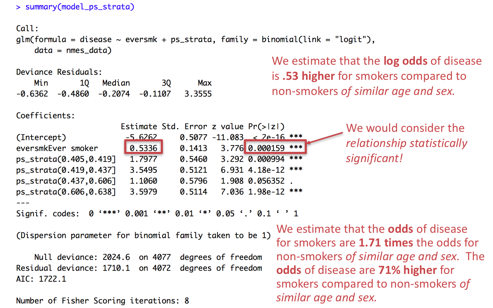
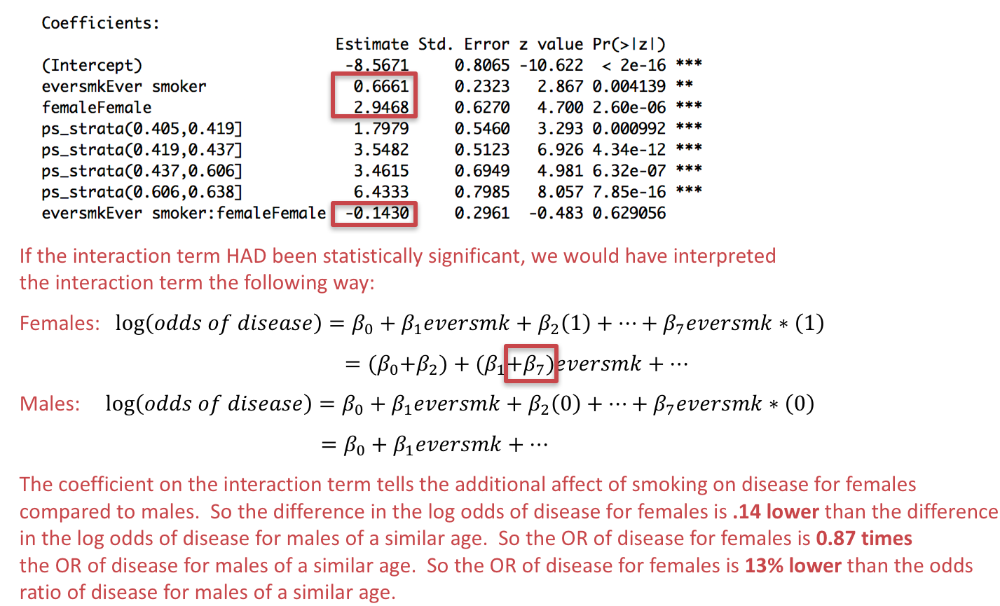

```{r setup, include=FALSE}
knitr::opts_chunk$set(echo = TRUE, message = FALSE, error = TRUE)
knitr::opts_knit$set(root.dir = "/cloud/project")
```

## Preliminaries

First load the packages that we will be using in this document:
```{r}
library(tidyverse)  # core group of tidyverse packages
library(kableExtra)  # to make nice tables
library(broom)  # for tidy model summaries
```

## Module 1: Smoking and the risk of disease

Questions of interest:

* **Question 1.1: ** How does the risk of disease compare for smokers and otherwise similar non-smokers?

<center>
{width=500px}
</center>

* **Queston 1.2: ** Does the contribution of smoking to the risk of disease vary by sex or socio-economic status (SES)?

<center>
{width=500px}
</center>

To address each question we want:

* A data display (graph or table)
* A statistical analysis (with interprepration)

We will answer these questions using data from the National Medical Expenditures Survey (NMES)

## Discussion of propensity scores verses logistic regression for Question 1-1

In your breakout groups, take 15-20 minutes to discuss the results of your propensity score analysis and multivariable logistic regression to answer Question 1.1.  Feel free to refer to the [Piazza thread](https://piazza.com/class/kjydcztl7915ch?cid=14){target="_blank"} with all student results, but below you can find pasted the student comment comparing the two analysis methods: 

* Both of these analysis methods indicate that the risk of disease is higher for smokers compared to otherwise similar non-smokers. This is indicated by the odds ratios found at statistically significant thresholds as defined by having a p value that is less than 0.05. I preferred the propensity score method to the multivariable logistic regression method when I added more variables since the propensity score method allowed me to better ensure an equal distribution of characteristics between smokers and non-smokers. However, the multivariable logistic regression method was easier to use since I did not have to add variables to ensure that quintiles could be formed. 

* Both methods of analysis answer question 1.1 and show that the odds of MSCD is higher in those that are smokers compared to nonsmokers that are similar in age, sex, and poverty status.  The relationship between smoking status and disease was statistically significant in both models. While the propensity score provided for more straightforward results, I preferred the logistic regression as it ensures that those you are comparing are the same instead of almost the same. Also, I found the logistic regression easier to understand, though I'm sure I will be able to understand the propensity score more as we continue to discuss it.

* Both models have pros and cons, but I think the regression method is preferable for a few reasons.  One can discern the individual effects of each of the potential confounders from this model, whereas with the propensity score model, one can only see the cumulative effect of all the confounders in the model.  Additionally, the regression model is much easier to understand.  While it depends on the audience and purpose of the report, I think the linear regression is preferrable in a broader range of circumstances because it is easier to conceptualize and understand.

* Comparing the two models. Both are sufficient in answering question 1.1 since they can both be used to see that smokers are more at risk for developing disease. The first model [logistic regression] is better for interpreting the effect of each accounted confounding variable, allowing more statements to be made on how they effect disease. On the other hand, model 2 (propensity) allows more specific focus on just the effect of smoking, and can analyze multiple variables at one time in one data representation (compared to a bar graph which only holds two other variables max). However, I think model 1 is the better model as it allows for interpretation of each variable by itself too, opening interoperation of separate variables for research while also answering the initial question. Either way, we can clearly see that smoking increases a person's chance for disease, no matter their age, sex, poverty status, or education.

* Both models answer the question in terms of comparing the risk of disease for smokers vs. otherwise similar non-smokers because they take into account confounders. The propensity model allows us to look at the effect of solely smoking while comparing across similar groups, whereas in the logistic regression model we can analyze each variable separately. For me, logistic regression is easier to understand because I can see multiple associations and relationships all at once. 

* Both of the models showed that those who smoked had a higher odds of MSCD compared to never smokers that are otherwise similar and so would be able to answer our question of interest. Since I only looked at two possible confounders, I preferred the logistic regression model since I knew exactly what the characteristics of the people in the subgroups were and had more information of how the other factors affected the odds of MSCD. I think the propensity score method would be helpful if I wanted to look at more possible cofounders and also would simplify the results by just focusing on relationship between smoking and MSCD. 

* These models both prove that there is a higher risk for smokers of similar age, sex and education status to develop an MSCD as compared to otherwise similar non-smokers. However, we see that the odds for the logistic regression model are significantly higher than the propensity score model. I would prefer to use the logistic model because it accounts for the risk for all the different confounding variables as compared to the propensity score, which only shows the risk/odds based on one variable - eversmk. However, both are effective at showing the increased risk associated with smoking for developing an MSCD. 

Discuss the following questions:

(1) How do the multivariable logistic regression results change depending on which adjustment variables are included in the model?  Do you think this is a problem?  Do these differences change the answer to Question 1.1?

(2) How do the results from the propensity score analyses compare to those from logistic regression?  Do you think any differences in the results are a problem?  Do these differences change the answer to Question 1.1?

(3) What are some of the pros/cons for each analysis method (logistic regression vs. propensity analysis)?  Which method do you prefer in this case, and why?

(4) In the student results, was it always clear which variables were included as adjustment variables in the logistic regression model?  Was is always clear which variables were included as adjustment variables in the propensity analysis?  If not, what are suggestions for either the table of results or the write-up that could make this clear?

(5) Where they any interpretations of results (for either model) that you found particularly well done?  What were the characteristics of those interpretations?

(6) What are you lingering questions about propensity scores?

## R notes based Assignment 1-3

Just a few notes this week: including numbers from your regression results directly into the text in R Markdown writing numerate sentences when summarizing your results.  Reminder: you should also feel free to ask questions on Piazza if there is something you would like us to help you learn how to do!

### Recoding the data
```{r}
nmes_data <- read_csv("module_1/nmesUNPROC.csv")

nmes_data <- nmes_data %>%
  mutate(eversmk = factor(eversmk, levels = c("0", "1"), labels = c("Never smoker", "Ever smoker")),
         lc5 = factor(lc5, levels = c("0", "1"), labels = c("No LC", "LC")),
         chd5 = factor(chd5, levels = c("0", "1"), labels = c("No CHD", "CHD")),
         female = factor(female, levels= c("0", "1"), labels = c("Male", "Female")),
         current = factor(current, levels= c("0", "1"), labels = c("Not current smoker", "Current smoker")),
         former = factor(former, levels= c("0", "1"), labels = c("Not former smoker", "Former smoker")),
         beltuse = factor(beltuse, levels= c("1", "2", "3"), labels = c("Rare", "Some", "Almost always")),
         educate = factor(educate, levels= c("1", "2", "3", "4"), labels = c("College grad", "Some college", "HS grad", "Other")),
         marital = factor(marital, levels= c("1", "2", "3", "4", "5"), labels = c("Married", "Widowed", "Divorced", "Separated", "Never married")),
         poor = factor(poor, levels= c("0", "1"), labels = c("Not poor", "Poor"))
         )

nmes_data <- nmes_data %>%
  mutate(disease = factor(lc5 == "LC" | chd5 == "CHD", 
                          levels=c(FALSE,TRUE), 
                          labels=c("No MSCD", "MSCD")))
```

### In-line code (including code in within the text)

In your written interpretations of your regression results, you all refer to values that are also presented in your tables of coefficients or odds ratios.  Instead of copying/pasting or typing these numbers into the text, you can refer directly to the values in your tables within your text.  This is called "in-line" code, and it is done using: tick r.

For example, suppose we created the following table of logistic regression results:
```{r}
my_model <- glm(disease ~ eversmk + age + female, family=binomial(link="logit"), data=nmes_data)

my_model_results <- tidy(my_model, 
                         exponentiate = TRUE,
                         conf.int = TRUE)

my_model_results$term <- c("Intercept", "Ever smoker", "Age (years)", "Female")

my_model_results
```

And we displayed it nicely in the following table:
```{r}
my_model_results %>%
  filter(term != "Intercept") %>% # remove the row with the intercept
  mutate(conf.int = paste0("(", round(conf.low, 2), ", ", round(conf.high, 2), ")")) %>% # combine the CI terms together into nice format 
  select(Variable = term, `Odds Ratio` = estimate, `p-value` = p.value, `95% Confidence Interval` = conf.int) %>% # select only the columns we want, rearrange columns, and change names
  kable(format = "pipe",
        digits = 3,
        align = c("l", "r", "r", "r"))
```

In the text, we might interpret the results as:

Holding age and sex constant, the odds of having a major smoking-caused disease among smokers is 2.2 times the odds of having a disease for non-smokers.

**If we don't want to type out this number, we could use in-line R code instead:** In our table of results (`my_model_results`), the odds ratio for smoking is stored in the `estimate` column where `term == "Ever smoker"`.  We can access that specific table location with:
```{r}
my_model_results %>% filter(term == "Ever smoker") %>% select(estimate) %>% pull()
```

Here the `pull()` function is used to give a single value rather than return a table.  We can then put this value within our text as `r my_model_results %>% filter(term == "Ever smoker") %>% select(estimate) %>% pull()`.  When the report is knit, the results of this code are inserted into the text.

When inserting numbers into text, `format()` is your friend. It allows you to set the number of digits so you don’t print to a ridiculous degree of accuracy.  We can also add `big.mark = ","` to make numbers easier to read or specify that we do not want to use scientific notation here:
```{r}
format(3452345, digits = 2, big.mark = ",")
format(0.12358124331, digits = 2, big.mark = ",")
format(9e-2, digits = 3, scientific = FALSE)
```

So we could re-write our results as:

Holding age and sex constant, the odds of having a major smoking-caused disease among smokers is `r my_model_results %>% filter(term == "Ever smoker") %>% select(estimate) %>% pull() %>% format(digits = 2)` times the odds of having a disease for non-smokers.

### Stating numerate results

When writing up your results, be sure to be numerate!  This means including actual values of odds ratios in your write-up (see above), but also means to include information about the statistical significance as well, with supporting evidence like a confidence interval of p-value.  For example, we could improve our intepretation above in a couple of ways:

Holding age and sex constant, the odds of having a major smoking-caused disease among smokers is `r my_model_results %>% filter(term == "Ever smoker") %>% select(estimate) %>% pull() %>% format(digits = 2)` times the odds of having a disease for non-smokers (p = `r my_model_results %>% filter(term == "Ever smoker") %>% select(p.value) %>% pull() %>% format(digits = 2, scientific = FALSE)`).

OR

Holding age and sex constant, the odds of having a major smoking-caused disease among smokers is `r my_model_results %>% filter(term == "Ever smoker") %>% select(estimate) %>% pull() %>% format(digits = 2)` times the odds of having a disease for non-smokers (95% CI for odds ratio: `r my_model_results %>% filter(term == "Ever smoker") %>% select(conf.low) %>% pull() %>% format(digits = 2)` to `r my_model_results %>% filter(term == "Ever smoker") %>% select(conf.high) %>% pull() %>% format(digits = 2)`).


### Adding figure captions and other graph tips

We can add figure captions to our plots in R Markdown.  This code chunk creates a string that will be used below as a figure caption:
```{r}
figcap.nmes = paste0("Figure 1: Scatter plot of log10 medical expenditures vs age for n=", nrow(nmes_data), " observations")
```

We can then add this figure caption to our code chunk header using the `fig.cap` argument in the code chunk header:
```{r, fig.cap = figcap.nmes}
nmes_data %>%
  mutate(log10exp = log10(totalexp)) %>%
  ggplot(mapping = aes(x = age, y = log10exp)) + 
  geom_point() + 
  geom_smooth(se = FALSE, color = "red")
``` 

Note that we can use options like `include = FALSE`, `echo = FALSE`, and `message = FALSE` in our code chunk headers to control what is printed out in the actual report.  So if we just want to include the graph and not the code for either the graph or the caption we could set `include = FALSE` for the caption definition chunk and `echo = FALSE` for the plot chunk.  We can also supress the message about `geom_smooth` by including `message = FALSE` in our chunk for the graph.

Then we **just** get the graph in our report while hiding all the code that went into creating it!

```{r include = FALSE}
figcap.nmes = paste0("Figure 1: Scatter plot of log10 medical expenditures vs age for n=", nrow(nmes_data), " observations")
```

```{r, fig.cap = figcap.nmes, echo = FALSE, message = FALSE}
nmes_data %>%
  mutate(log10exp = log10(totalexp)) %>%
  ggplot(mapping = aes(x = age, y = log10exp)) + 
  geom_point() + 
  geom_smooth(se = FALSE, color = "red")
``` 

## Interpreting propensity score results

Suppose we calculate propensity scores based on **age** and **sex**:
```{r}
# fit propensity score model: trt ~ confounders
prop_model <- glm(eversmk ~ age + female, family = binomial(link="logit"), data=nmes_data, na.action = na.exclude)

# calculate propensity scores:
nmes_data <- nmes_data %>%
  mutate(ps = predict(prop_model, type = "response"))

# calculate propensity score quintiles:
ps_quintiles <- quantile(nmes_data$ps, probs=c(0, 0.2, 0.4, 0.6, 0.8, 1), na.rm=TRUE)

nmes_data <- nmes_data %>%
  mutate(ps_strata = cut(ps, breaks=ps_quintiles, include.lowest=TRUE))

# model log odds of disease from smoking and ps quintiles
model_ps_strata <- glm(disease ~ eversmk + ps_strata, family = binomial(link="logit"), data=nmes_data)
summary(model_ps_strata)

# transform log OR to OR
exp(coef(model_ps_strata))
```

We would interpret the coefficient for `eversmk` as follows.  We *do not* need to interpret the coefficients for the propensity score quintiles because these variables are just there for adjustment purposes are are not the relationship of interest!

<center>
{width=600px}
</center>

## Effect modification

Now we will finally consider **Queston 1.2: ** Does the contribution of smoking to the risk of disease vary by sex or socio-economic status (SES)?

<center>
{width=500px}

</center>

An **effect modification** (or **interaction**) is present when the relationship between a predictor of interest and the outcome varies by the level (subgroup) of another variable.

For example, if we thought the effect of smoking on disease was different (larger or smaller) for males than it is for females, we would want to consider a model that allows sex to *modify* the relationship between smoking and disease.

### Looking for effect modification in a graph or table

How could we investigate whether sex *modifies* the relationship between smoking and disease using a data display?

We can use a similar display to what we've already considered, but stratified by our potential effect modifier:

```{r}
my_table <- nmes_data %>%
  count(female, eversmk, disease) %>%
  group_by(female, eversmk) %>%
  mutate(prop = n/sum(n)) %>%
  filter(disease == "MSCD")

my_table %>%
  ggplot() +
  geom_bar(aes(x = eversmk, y = prop), stat = "identity") + 
  facet_wrap(~ female)
```

What, if anything, does this graph suggest about whether there's a different relationship between smoking and disease for male compared to female individuals?

We can also look at this by graphing the relative risk of disease separately for the male and female individuals:
```{r}
my_table <- nmes_data %>%
  count(female, eversmk, disease) %>%
  group_by(female, eversmk) %>%
  mutate(prop = n/sum(n)) %>%
  filter(disease == "MSCD") %>%
  ungroup() %>%
  group_by(female) %>%
  mutate(rel.risk = prop/prop[eversmk == "Never smoker"])
  
my_table

my_table %>%
  filter(eversmk == "Ever smoker") %>%
  ggplot() +
  geom_bar(aes(x = female, y = rel.risk), stat = "identity")
```

It looks like the relative risk of disease (comparing smokers to non-smokers) is larger for males compared to female individuals.  This could indicate an effect modification!  The question is whether this is statistically significant, and whether it holds once we compare smokers to "otherwise similar" non-smokers:

```{r}
my_table <- nmes_data %>%
  count(poor, female, eversmk, disease) %>%
  group_by(poor, female, eversmk) %>%
  mutate(prop = n/sum(n)) %>%
  filter(disease == "MSCD")

my_table %>%
  ggplot() +
  geom_bar(aes(x = eversmk, y = prop), stat = "identity") + 
  facet_wrap(~ female + poor)

my_table <- nmes_data %>%
  count(poor, female, eversmk, disease) %>%
  group_by(poor, female, eversmk) %>%
  mutate(prop = n/sum(n)) %>%
  filter(disease == "MSCD") %>%
  ungroup() %>%
  group_by(poor, female) %>%
  mutate(rel.risk = prop/prop[eversmk == "Never smoker"])

my_table %>%
  filter(eversmk == "Ever smoker") %>%
  ggplot() +
  geom_bar(aes(x = female, y = rel.risk), stat = "identity") +
  facet_wrap(~ poor)
```

### Ways to include effect modification

* We could do separate analyses for each subgroup and report the estimate with confidence interval by subgroup.

**OR**

* We could include an interaction between smoking and the indicator of the subgroup in the second step of the propensity score analysis.

What would this look like compared to the analysis we did before where we constructed propensity scores based on age and sex?

### Separate analyses for each subgroup

First, let's do separate analyses for each subgroup of sex.  To do this, we need to create subsets of our data that just contain the males and just contain the females:
```{r}
nmes_data_male <- nmes_data %>%
  filter(female=="Male")

nmes_data_female <- nmes_data %>%
  filter(female=="Female")
```

Now we do our propensity score analysis for each subgroup separately, so on the `nmes_data_male` data set instead of the `nmes_data` data set.

We will have to be careful here *not* to include sex when we construct our propensity scores, however, because everyone in each of these subsets of data has the same value of sex.

First we do this for male individuals.  To save myself some copy/paste errors when I do the same for female individuals, I am going to define a generic data set at the top of this code, called `my_data`, so I don't have to change the dataset when I switch to the female subpopulation:
```{r}
my_data <- nmes_data_male

# fit propensity score model: trt ~ confounders
prop_model <- glm(eversmk ~ age + female, family = binomial(link="logit"), data=my_data, na.action = na.exclude)
```

Oops!  We shouldn't include `female` in this propensity score model, since all the subjects are male and have the same value of this variable!  Let's try again with just age.

```{r}
prop_model <- glm(eversmk ~ age, family = binomial(link="logit"), data=my_data, na.action = na.exclude)

# calculate propensity scores:
my_data <- my_data %>%
  mutate(ps = predict(prop_model, type = "response"))

# calculate propensity score quintiles:
ps_quintiles <- quantile(my_data$ps, probs=c(0, 0.2, 0.4, 0.6, 0.8, 1), na.rm=TRUE)

my_data <- my_data %>%
  mutate(ps_strata = cut(ps, breaks=ps_quintiles, include.lowest=TRUE))

# model log odds of disease from smoking and ps quintiles
model_ps_strata <- glm(disease ~ eversmk + ps_strata, family = binomial(link="logit"), data=my_data)
tidy(model_ps_strata)

# transform log OR to OR
tidy(model_ps_strata, exponentiate = TRUE)

# also get confidence intervals of OR
tidy(model_ps_strata, exponentiate = TRUE, conf.int = TRUE )

```

**We estimate the odds of disease for male smokers are 2 times the odds for male non-smokers of similar ages (95% CI for OR: 1.25 to 3.18).**

Now we do this again for the female individuals:
```{r}
my_data <- nmes_data_female

# fit propensity score model: trt ~ confounders
# we shouldn't include `female` in this propensity score model, since all subjects are male!
prop_model <- glm(eversmk ~ age, family = binomial(link="logit"), data=my_data, na.action = na.exclude)

# calculate propensity scores:
my_data <- my_data %>%
  mutate(ps = predict(prop_model, type = "response"))

# calculate propensity score quintiles:
ps_quintiles <- quantile(my_data$ps, probs=c(0, 0.2, 0.4, 0.6, 0.8, 1), na.rm=TRUE)

my_data <- my_data %>%
  mutate(ps_strata = cut(ps, breaks=ps_quintiles, include.lowest=TRUE))

# model log odds of disease from smoking and ps quintiles
model_ps_strata <- glm(disease ~ eversmk + ps_strata, family = binomial(link="logit"), data=my_data)
tidy(model_ps_strata)

# transform log OR to OR
tidy(model_ps_strata, exponentiate = TRUE)

# also get confidence intervals of OR
tidy(model_ps_strata, exponentiate = TRUE, conf.int = TRUE )
```

**We estimate the odds of disease for female smokers are 1.86 times the odds for female non-smokers of similar ages (95% CI for OR: 1.29 to 2.67).**

In these subgroups, it doesn't appear there is effect modification, because although the estimated odds ratios are different, the confidence intervals for these odds ratios overlap.

### Including an interaction term

We can consider effect modification directly in our overall model by including an interaction term between our effect modifier and the treatment variable along with propensity adjustment.  

To do this, we first construct propensity scores, making sure to include the effect modifier in the propensity score calculation:
```{r}
my_data <- nmes_data

# fit propensity score model: trt ~ confounders, making sure to include the effect modifier here!
prop_model <- glm(eversmk ~ age + female, family = binomial(link="logit"), data=my_data, na.action = na.exclude)

# calculate propensity scores:
my_data <- my_data %>%
  mutate(ps = predict(prop_model, type = "response"))

# calculate propensity score quintiles:
ps_quintiles <- quantile(my_data$ps, probs=c(0, 0.2, 0.4, 0.6, 0.8, 1), na.rm=TRUE)

my_data <- my_data %>%
  mutate(ps_strata = cut(ps, breaks=ps_quintiles, include.lowest=TRUE))
```

Then, we can model the log odds of disease based on `eversmk`, `female`, and the interaction between the two:
```{r}
# model log odds of disease from smoking and ps quintiles, with an interaction between eversmk*female
model_ps_strata <- glm(disease ~ eversmk*female + ps_strata, family = binomial(link="logit"), data=my_data)
tidy(model_ps_strata)

# transform log OR to OR
tidy(model_ps_strata, exponentiate = TRUE)

# also get confidence intervals of OR
tidy(model_ps_strata, exponentiate = TRUE, conf.int = TRUE )
```

There's no evidence of effect modification (interaction) between sex and smoking status, because the interaction term is not statistically significant (p = 0.63).  So we would not use this interaction model and would instead return to the propensity score model without the interaction.

How **would** we have interpreted the interaction terms **if** the interaction had been statistically significant?

<center>
{width=600px}
</center>

### Including an interaction term in a multivariable logistic regression model

You can test for effect modification within a multivariable logistic regression model as well, but including an interaction term between `eversmk` and your potential effect modifier and then including the other adjustment variable directly rather than through propensity score quintiles.
```{r}
# model log odds of disease from smoking and ps quintiles, with an interaction between eversmk*female
model_logistic <- glm(disease ~ eversmk*female + age, family = binomial(link="logit"), data=my_data)
tidy(model_logistic)

# transform log OR to OR
tidy(model_logistic, exponentiate = TRUE)

# also get confidence intervals of OR
tidy(model_logistic, exponentiate = TRUE, conf.int = TRUE )
```

The interpretation of the interaction term (effect modification) is similar as in the propensity score case, but we are holding the other covariates (age, in this case) constant directly rather than just grouping those with similar propensities as determined by age.

## Assignment 1.4: Final Module 1 Report

Finalize your report for Module 1 to answer Questions 1.1 and 1.2.

* For each question, you should have a data display and a statistical analysis to address the question.
* For Question 1.1, decide whether you want to use a multivariable logistic regression model or a propensity score analysis to answer the question.
* For Question 1.2, think about what type of graph would show whether there is effect modification present.
* For Question 1.2, include an interaction in either your multivariable logistic regression or your propensity score analysis to formally test whether effect modification exists. 


You should also do the following:

* Provide a caption for your data displays.
* Write up your results in a few paragraphs to answer both questions.  In your write-up, you should refer to your data displays and your analysis results.  Be numerate!
* Here's a great resource for tables/figures for scientific papers:
[http://abacus.bates.edu/~ganderso/biology/resources/writing/HTWtablefigs.html](http://abacus.bates.edu/~ganderso/biology/resources/writing/HTWtablefigs.html)

Submit your data display in R Markdown through Github by Monday (February 22, 2021) at midnight.

* You may work together on this assignment, but you must submit your own assignment; please credit in your assignment anyone with whom you collaborated.

* Next week in class we will start Module 2!