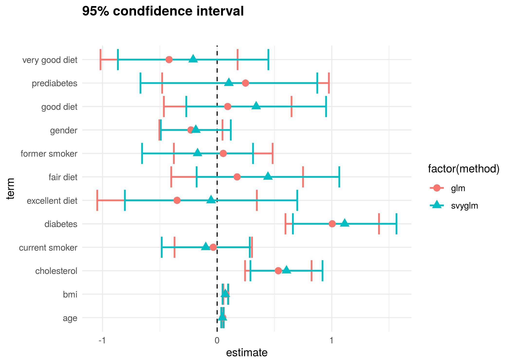
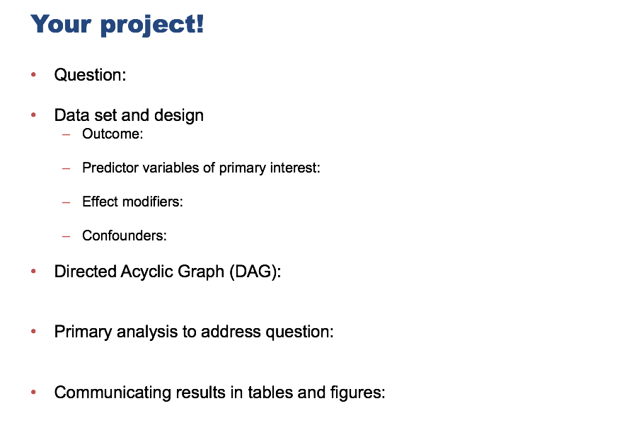
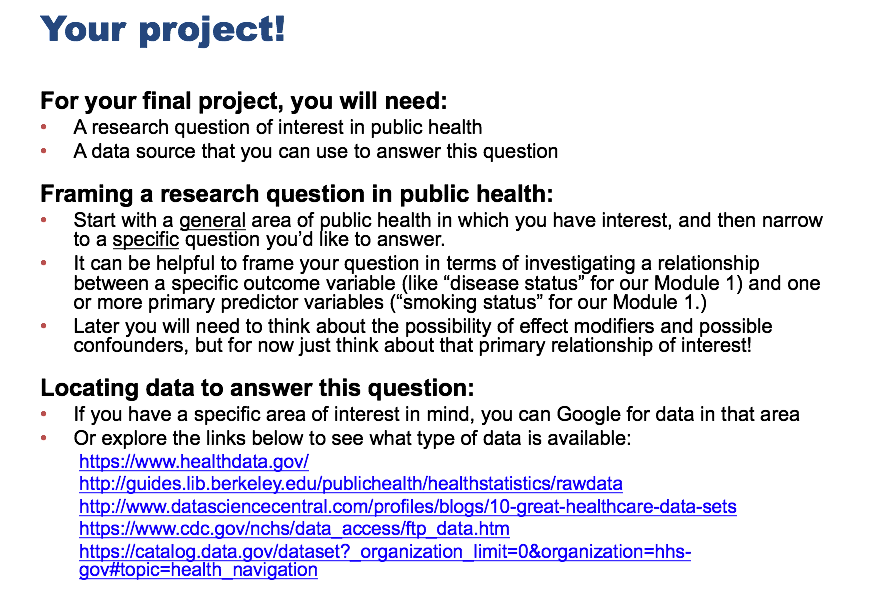

```{r setup, include=FALSE}
knitr::opts_chunk$set(echo = TRUE, message = FALSE, error = TRUE)
knitr::opts_knit$set(root.dir = "/cloud/project")
```

## Module 2: Factors that are associated with development of hypertension

Recall that our main questions of interest are:

  * Question 2.1: What factors measured in the NYC HANES survey are associated with having hypertension?
  * Question 2.2: How do our estimates from survey-weighted logistic regression differ from those where we ignore survey weights?


The data science learning objectives for this module include:

  * Understand the components of a data analysis report
  * Gain experience performing data cleaning, and assessing whether you have been successful
  * Practice selecting data visualizations that fit into the context of your statistical analysis

The statistical learning objectives for this module include:

  * Gain further experience with logistic regression and selecting an appropriate model for your question
  * Understand what a survey-weighted analysis is and how/when we perform one
  * Learn how to select survey weights for unbalanced data


## Reminder: What are the data?

For this case study, we will use data from the [New York City (NYC) Health and Nutrition Examination Survey (NYC HANES)](http://nychanes.org/){target="_blank"}, 
modeled on the 
[National Health and Nutrition Examination Survey (NHANES)](https://wwwn.cdc.gov/nchs/nhanes/default.aspx){target="_blank"}. NHANES is a population-based, cross-sectional study with data collected 
from a physical examination and laboratory tests, as well as a face-to-face 
interview and an audio computer-assisted self-interview (ACASI). It is 
designed to assess the health and nutritional status of adults and children 
in the United States. NYC HANES is a local version of NHANES, which implies 
it mainly focuses on New York area. 


## Learning objectives for today

Our main question of interest for this module is: Based on the data collected from NYC HANES, which risk factors play a role in development of hypertension?

Today, we will continue to work toward answering this by learning how to:

* Understand how to include inline R code and why it is useful.
* Describe what makes an effective comparison of survey-weighted and unweighted model results and share some examples of tables and figures that some of you included with your assignments this week.
* Further discuss strategies for approaching model selection: how do you decide what variables to include in your model and how do you compare different models?
* Touch base on any questions about selecting the correct survey weights to use in your analysis.
* Touch base about your final projects to hear what you have been working on so far.


## What is inline R code and why is it useful?

Start by loading libraries and raw data set.
```{r}
library(tidyverse)  # core group of tidyverse packages
library(knitr)  # to make nice tables
library(ggpubr)
library(ggrepel)
library(tidyverse)
library(kableExtra)
library(survey)
library(haven)
library(broom)
library(plotrix)
library(pander)

dat <- read_sas('module_2/data/d.sas7bdat')
dim(dat)
```

```{r , echo=FALSE}
hy_df <- 
  dat %>% 
    select(id = KEY,
           age = SPAGE,
           race = DMQ_14_1,
           gender = GENDER,
           diet = DBQ_1,
           income = INC20K,
           diabetes = DIQ_1,
           bmi = BMI,
           cholesterol = BPQ_16,
           drink = ALQ_1_UNIT,
           smoking = SMOKER3CAT,
           hypertension = BPQ_2,
           surveyweight = EXAM_WT)

hy_df <- hy_df %>% 
          mutate(drink = ifelse(dat$ALQ_1 == 0, 4, drink))

hy_df <- hy_df %>% mutate(race=factor(race, levels=c(100, 110, 120, 140, 180, 250), 
                      labels=c('White', 'Black/African American', 
                              'Indian /Alaska Native', 
                              'Pacific Islander', 
                              'Asian', 'Other Race')),
                     gender = factor(gender, levels=c(1,2), 
                        labels=c('Male', 'Female')),
                     diet = factor(diet, levels=c(5:1), 
                      labels=c('Poor', 'Fair', 'Good', 
                               'Very good','Excellent')),
                     income = factor(income, levels=c(1:6), 
                        labels=c('Less than $20,000','$20,000 - $39,999',
                                 '$40,000 - $59,999','$60,000 - $79,999',
                                 '$80,000 - $99,999','$100,000 or more')),
                     diabetes = factor(diabetes, levels=c(2,1,3), 
                          labels=c('No','Yes','Prediabetes')),
                     cholesterol = factor(cholesterol, levels=c(2,1), 
                             labels=c('Low value','High value')),
                     drink = factor(drink, levels=c(4,1,2,3), 
                       labels=c('Never','Weekly', 'Monthly', 'Yearly')),
                     smoking = factor(smoking, levels=c(1,3,2), 
                         labels=c('Never smoker','Former smoker','Current smoker')),
                     hypertension = factor(hypertension, levels=c(2,1), 
                              labels=c('No','Yes'))
                     )

## we will not use this in our survey design object, but will use it for visualizations below
hy_p_df <-
  hy_df %>%
  drop_na()


hypertension_design <- svydesign(
  id = ~1,
  weights = ~hy_df$surveyweight,
  data = hy_df
)
h_design_nona <- subset(hypertension_design, complete.cases(hy_df))
```

```{r}
### survey-weighted logistic regression -- not including bmi
g1 <- svyglm(hypertension ~ 
               age + cholesterol + income + 
               diabetes,
              family = quasibinomial(link = 'logit'), 
             design = h_design_nona)

g1_res <- tidy(g1, exponentiate = TRUE, conf.int = TRUE)
pander(g1_res)
```

Suppose I wanted to write some sentences to summarize what this model output is telling us. I could run the code, look at the numbers, and then type them here:

For example:
Holding all other variables constant, a one-unit increase in age is associated with a 3.9% increase in the odds of hypertension. This is statistically significantly different from zero because it has a p value of 5.05e-13, which is < 0.05.

Instead of running the code and copying the numbers from the output, you could pull them directly from the R objects using code:
Holding all other variables constant, a one-unit increase in age is associated with  `r round(100*(g1_res %>% filter(term == "age") %>% pull(estimate)) - 100,1)`% increase in the odds of hypertension. This is statistically significantly different from zero because it has a p value of `r format(g1_res %>% filter(term=="age") %>% pull(p.value), digits=3)`, which is < 0.05.

Although you can't see it in the knitted document, this second paragraph does not contain the numbers themselves, but R code to generate and format the numbers that should be included in the model write-up. For example, to generate the percent increase, the code is: `round(100*(g1_res %>% filter(term == "age") %>% pull(estimate)) - 100,1)`. And to generate the p-value, it is `format(g1_res %>% filter(term=="age") %>% pull(p.value), digits=3)`.


Why is this useful? 

* It is not susceptible to typos, i.e., copying and pasting the wrong numbers.
* It is easy to update, for example, if you fit a new model. Suppose you realize that you actually meant to include BMI as a covariate. 

```{r}
### survey-weighted logistic regression -- not including bmi
g1 <- svyglm(hypertension ~ 
               bmi + age + cholesterol + income + 
               diabetes,
              family = quasibinomial(link = 'logit'), 
             design = h_design_nona)

g1_res <- tidy(g1, exponentiate = TRUE, conf.int = TRUE)
pander(g1_res)


```

If I had hard-coded numbers into my output summary, I would have to go back and re-write and double check the numbers. But if I have used code, the same code will just give me updated results:

Holding all other variables constant, a one-unit increase in age is associated with  `r round(100*(g1_res %>% filter(term == "age") %>% pull(estimate)) - 100,1)`% increase in the odds of hypertension. This is statistically significantly different from zero because it has a p value of `r format(g1_res %>% filter(term=="age") %>% pull(p.value), digits=3)`, which is < 0.05.

A few tips to make things easier:

* You will probably want to save your model output and/or some processed versions in R objects that you can easily refer to in your inline code, like `g1_res` above.
* You should try to use variable names and the tidyverse piping commands as much as possible, rather than indexing into specific rows or columns of your output. For example, if you had written code referring to `age` as the third variable in the model (for example using `g1_res[3, 2]` to access the odds ratio), this would be incorrect in the new model, where `bmi` is included before `age`.

You can create whatever output you want in your R code and refer back to it using inline code:
```{r}
foo <- "this is a test"
```

Print `r foo`.


## Getting to Question 2.2

Recall Question 2.2: How do our estimates from survey-weighted logistic regression differ from those where we ignore survey weights?

To answer this, use your final model from your survey-weighted analysis and fit a standard (unweighted) logistic regression instead. How might you want to compare the results of these two models? A table? Some kind of visualization?

Some of you had some great examples of tables and figures in your work this week on Piazza. I'll show some code below for a couple versions of the tables.


I'll also show code for making a plot like this one, although some of you made really nice plots as well this week and posted them on Piazza:

<center>

</center>

### Preliminaries: Generate the data for the table/plot

How would we go about making a figure like this? We first need to create a data frame with odds ratios and confidence intervals for the two methods. Recall that we created a nice data frame of the output of our survey-weighted glm using the `tidy` function:

```{r}
pander(g1_res)
```

We then want to fit the same model using un-weighted logistic regression: 

```{r}
### unweighted logistic regression
g1_noWt <- glm(hypertension ~ 
               bmi + age + cholesterol + income + 
               diabetes,
              family = quasibinomial(link = 'logit'), data=hy_p_df)

g1_noWt_res <- tidy(g1_noWt, exponentiate = TRUE, conf.int = TRUE)
pander(g1_noWt_res)
```

### Example tables

Now that we have both versions of the results, we can work on combining them in different ways to make some tables.

We want to start by joining the results from the two tables.
```{r}
g1_join <- inner_join(g1_res, g1_noWt_res, by = "term", suffix = c(".Wt", ".noWt"))
```


This example includes some nice grouped labels for the weighted and unweighted results, using the `add_header_above` function from `kableExtra`:

```{r}
tblcap.3 <- "Table 3: Comparison of weighted and unweighted results"
comp_tbl <- g1_join %>%
  select(term, `OR` = `estimate.Wt`,`Std Error` = `std.error.Wt`, `p-value` = `p.value.Wt`, `OR ` = `estimate.noWt`, `Std Error ` = `std.error.noWt`, `p-value ` = `p.value.noWt`) %>% 
  kable(format = "html",
        digits = 2,
        caption = tblcap.3) %>%
  add_header_above(c(" ","Survey Weighted" = 3, "Non-weighted" = 3))%>%
  kable_styling(full_width = TRUE)

comp_tbl

```

One thing I would like to improve about this plot is the way the p-values are displayed as 0's. There are several approaches to changing this; I am showing one here using the `formatC` function.  You can see some further examples of how to play around with this [here](https://stackoverflow.com/questions/39623636/forcing-r-output-to-be-scientific-notation-with-at-most-two-decimals){target="_blank"}.


```{r}
tblcap.3 <- "Table 3: Comparison of weighted and unweighted results"
comp_tbl <- g1_join %>%
  mutate(p.value.Wt = formatC(p.value.Wt, digits = 2, format = "g"), p.value.noWt = formatC(p.value.noWt, digits = 2, format = "g")) %>% 
  select(term, `OR` = `estimate.Wt`,`Std Error` = `std.error.Wt`, `p-value` = `p.value.Wt`, `OR ` = `estimate.noWt`, `Std Error ` = `std.error.noWt`, `p-value ` = `p.value.noWt`) %>% 
  kable(format = "html",
        digits = 2,
        caption = tblcap.3) %>%
  add_header_above(c(" ","Survey Weighted" = 3, "Non-weighted" = 3))%>%
  kable_styling(full_width = TRUE)

comp_tbl

```

One of you also found another package that makes really nice looking tables, the package `gtsummary`, with the function `tbl_regression`. It is a little fidgety with the variable names for some reason, but the tables also include the baseline levels of the variables, for example, which is quite useful. There is a tutorial about how to use this package [here](https://cran.r-project.org/web/packages/gtsummary/vignettes/tbl_regression.html){target="_blank"}.

```{r}
library(gtsummary)

tbl1<-tbl_regression(g1, exponentiate = TRUE, label = list(age = "age", bmi = "bmi"))%>%
  bold_labels()%>%
  bold_p()


tbl2<-tbl_regression(g1_noWt, exponentiate=TRUE, label = list(age = "age", bmi = "bmi"))%>%
  bold_labels()%>%
  bold_p()

tbl_merged <-
  tbl_merge(
    tbls = list(tbl1, tbl2),
    tab_spanner = c("**Survey Weighted**", "**Unweighted**")
  )

tbl_merged

```


### Example plots


To plot these results on the same plot, we need to combine these two results into one data frame, with some indicator of which results are which.

```{r}

g1_res <- g1_res %>% mutate(method="Weighted")
g1_noWt_res <- g1_noWt_res %>% mutate(method="Unweighted")

g1_both<-rbind(g1_res, g1_noWt_res)

```

We can try a couple different ways of combining these results:

```{r}
g1_both %>% ggplot(aes(x=estimate, y=term))+
    xlab("Difference in log odds (95% Confidence Interval)")+
    geom_errorbarh(aes(xmin=conf.low, xmax=conf.high,col=method),width=0.5,cex=1)+ 
    facet_wrap(~term,strip.position="left",nrow=9) +
    geom_vline(xintercept = 1, linetype = "dashed") +
    geom_point(aes(color = factor(method),
                    shape = factor(method)),size = 3)+
    theme(plot.title=element_text(size=16,face="bold"),
        axis.text.y=element_blank(),
        axis.ticks.y=element_blank(),
        axis.text.x=element_text(face="bold"),
        axis.title=element_text(size=12,face="bold"),
        strip.text.y = element_text(hjust=0,vjust = 1,angle=180,face="bold"))
 

g1_both %>% ggplot(aes(x=estimate, y=term))+
    xlab("Difference in log odds (95% Confidence Interval)")+
    geom_errorbarh(aes(xmin=conf.low, xmax=conf.high,col=method),width=0.5,cex=1)+ 
    facet_wrap(~term,strip.position="left",nrow=9, scales="free_x") +
    geom_vline(xintercept = 1, linetype = "dashed") +
    geom_point(aes(color = factor(method),
                    shape = factor(method)),size = 3)+
    theme(plot.title=element_text(size=16,face="bold"),
        axis.text.y=element_blank(),
        axis.ticks.y=element_blank(),
        axis.text.x=element_text(face="bold"),
        axis.title=element_text(size=12,face="bold"),
        strip.text.y = element_text(hjust=0,vjust = 1,angle=180,face="bold"))


 g1_both %>% ggplot(aes(x = estimate, y = term),
     group_by(g1_both$method)) +
     geom_vline(xintercept = 1, linetype = "dashed") +
     geom_errorbarh(aes(estimate, term, xmin = conf.low, 
     xmax = conf.high, color = factor(method),width = 0.3), size = 0.8)+
     geom_point(aes(color = factor(method),
                    shape = factor(method)),size = 3)+
    theme(axis.title.x = element_blank(),
    axis.title.y = element_blank()) +
    ggtitle(expression(atop(bold("95% condfidence interval"))))+
   theme_minimal()

 
g1_both %>% filter(term != "(Intercept)") %>% ggplot(aes(x = estimate, y = term),
     group_by(g1_both$method)) +
     geom_vline(xintercept = 1, linetype = "dashed") +
     geom_errorbarh(aes(estimate, term, xmin = conf.low, 
     xmax = conf.high, color = factor(method),width = 0.3), size = 0.8)+
     geom_point(aes(color = factor(method),
                    shape = factor(method)),size = 3)+
    theme(axis.title.x = element_blank(),
    axis.title.y = element_blank()) +
    ggtitle(expression(atop(bold("95% condfidence interval"))))+
   theme_minimal()

```

Here are a couple more examples from code that was turned in this week. This one uses `position_dodge` to put some space between the CIs so they do not overlap:

```{r}
compare_graph <- g1_both %>%
  filter(term != "(Intercept)") %>%
  ggplot(aes(x = term, y = estimate, color = method)) +
    geom_pointrange(aes(ymin = conf.low, ymax = conf.high),
                    position = position_dodge(width = 0.35),
                    size = 0.75) +
    geom_hline(yintercept = 1.0, linetype = "dotted", size = 1) +
    labs(title = "Comparing Unweighted and Weighted Logistic Regression Outputs", 
         y = "Odds ratio", x = "Variable") +
    coord_flip(ylim = c(-1, 5)) +
  theme_bw()

compare_graph

```

This last example uses a function from the `jtools` package, which you can read more about [here](https://jtools.jacob-long.com){target="_blank"}. We also need to install the `ggstance` and `broom.mixed` packages to get this to work without an error. This function is powerful, but does sweep some things under the rug, so you might want to be careful using it. 

```{r}
library(jtools)
plot_summs(g1, g1_noWt, scale = TRUE, model.names = c("Survey-Weighted", "Non Survey-Weighted"), exp = TRUE)
```


Note that these are not necessarily finalized -- they are just some suggestions to help get you started!

## Model selection

You've now fit at least one model using these data. But how do you know if it is a good model for answering our question of interest? There are many approaches to answering this question.

One way you can decide what variables to include in a model is by looking at whether the model coefficients associated with those variables are statistically significantly different from zero. This tells you whether the value of the outcome (in this case log odds of having hypertension) varies as this particular input variable changes, considering all other variables in your model. So you can look at the t-statistics and p-values associated with this variable to see whether you would reject the null hypothesis that the parameters associated with this variable are zero. 


For example, we can look at these two models that we fit last week:

```{r, warning=TRUE}
g0 <- svyglm(hypertension ~ smoking, 
    family = quasibinomial(link = 'logit'), design = h_design_nona)
summary(g0)

g1 <- svyglm(hypertension ~ 
               age + race + gender + diet + income + 
               diabetes + bmi + cholesterol + drink + smoking,
             family = quasibinomial(link = 'logit'), 
             design = h_design_nona)
summary(g1)
```


Not all of the variables in our full model `g1` are considered statistically significant so we would perhaps
like to remove some of them to get a reduced model. However, you may want to keep a variable in the model, even if the coefficients are not significantly different from zero if that variable is important for the question you are trying to answer.

Last week, we discussed Akaike's Information Criterion (AIC) as a tool for comparing different models, that takes into account both how many variables you include and how well the model fits the data.

Below, we can see that `g1`, where we include multiple predictors has the lowest AIC value. Looking at this value combined with your model summary output will help you determine which of your models is the best choice for your final analysis.

```{r}
AIC(g0, g1)
```

### Selecting the weights

Because the NYC HANES 2013-2014 data have been collected to address a variety of different questions and using different surveys, the researchers who produced the data have employed a somewhat complex weighting scheme to compensate for unequal probability of selection. Five sets of survey weights have been constructed to correspond to different sets of variables that were collected: CAPI  weight, Physical weight, Blood Lab result weight, Urine Lab results weight and Salica Lab results weight. **The determination of the most appropriate weight to use for a specific analysis depends upon the variables selected by the data analyst**. 


We will give a table to indicate each variable's origin stream:


| Variable names   |      Component      |
|---------------------------------|---------------------------------|
| age                                   | CAPI                                                                                                                                                                 |
| race                                  | CAPI                                                                                                                                                                 |
| gender                                | CAPI                                                                                                                                                                 |
| diet                                  | CAPI                                                                                                                                                                 |
| income                                | CAPI                                                                                                                                                                 |
| diabetes                               | CAPI                                                                                                                                                               |
| cholesterol                           | CAPI                                                                                                                                                                 |
| drink                                 | CAPI                                                                                                                                                                 |
| smoking                               | CAPI                                                                                                                                                                 |
| hypertension                           | CAPI                                                                                                                                                                |
| bmi                                    | EXAM                                                                                                                                                                |


When an analysis involves variables from different components of the survey, the analyst should decide whether the outcome is inclusive or exclusive, and then choose certain weights. To learn how to use weights for different purposes, refer to the particular [Analytics Guidelines](http://nychanes.org/wp-content/uploads/sites/6/2015/11/ANALYTIC-GUIDELINES-2016_V2.pdf) for the survey. 

In our case, we choose EXAM weight since our analysis is exclusive. Do you remember we have removed all of the missing values? Now our dataset is limited to those who received a physical exam test, which means all of our survey participants have a value for the `EXAM_WT` variable. We selected this variable and renamed it as `surveyweight` in the earlier datacleaning part of this analysis. 

NYC HANES has put together some really useful documentation to give some further examples of how to select the correct weight to use in different cases: the slideshow at [Weight Adjustment](http://nychanes.org/wp-content/uploads/sites/6/2015/11/NYC-HANES-Training-Slides_part-2_08222016.pdf){target="_blank"} explains how the NYC HANES data are weighted in order to compensate for unequal probability of selection and explains how to choose the correct weight for analysis, including some hypothetical analysis scenarios. In order to determine the sources of the different variables, you can refer to the [Variable Codebook](http://nychanes.org/wp-content/uploads/sites/6/2019/01/28283961_NYC-HANES_codebook_Public_V3_011019.pdf){target="_blank"}.


#### Some final notes on survey weights

Remember that the weight variable that you use will depend on the set of variables that will be included in your final model. You may need to revisit this choice depending on what your final model is.

## Assignment 2.4 (final project for Module 2)

Write a complete report investigating the questions of interest from this module. Your report should include:

* Some simple/concise background on the data set and a clear presentation of the question you want to answer;
* An exploratory data analysis, where you use data visualizations (tables and figures) to illustrate relationships between variables in the data set, as they relate to the question you are interested in answering, and then discuss what these visualizations tell you;
* Model results presented in a tidy way, perhaps with a nice table of relevant coefficients and p-values, including a clear discussion of the effects of the variables included in the model;
* A comparison of results from the survey-weighted model to those from a standard glm, and a brief discussion of what you see.


In the written portions of your report, think about connecting each table or visualization that you make with your downstream modeling choices. How do your displays point you toward the model you end up fitting? 

Also, think about justifying each choice of variable in your model: can you use a visualization to do this? Look at significance of coefficients? Talk about how you are curious about a specific variable and how it influences hypertension? Compare models using AIC to decide on your final model?

What is an effective way of illustrating how the results of the weighted and unweighted approaches compare?

Finally, try to make your report as readable as possible: hide any R code or warning messages, try to make the tables readable, etc. 

* Submit your updated analysis report in R Markdown through Github by Sunday March 28, 2021 at midnight.
* Post a screenshot of some aspect of your final project that you think is particularly interesting on Piazza in the "Assignment 2-4 Results" thread.  Add a sentence or two about what you can conclude based on your analysis. You are welcome to post this anonymously to your classmates. You can also include comments about what your chose to do or questions you had as you were making the display and fitting your model.
* You may work together on this assignment, but you must submit your own report; please credit in your assignment anyone with whom you collaborated.
* There is no class next week due to a spring break day; in class two weeks from now we will continue with discussion of your final project ideas.

## Looking ahead to your final projects

It is time to start thinking about your final projects, which will be the focus of the course after we wrap up Module 2. To help you get started, we have created a Google Doc where you can record your plans. This will help you organize your thoughts, find classmates working on similar questions, and help us keep track of who is working on what.

Here is link to the [doc](https://docs.google.com/document/d/1hzYiJUu3oL-vz-n4pLffufUwBiV05O_g3NwT5TBdhqg/edit?usp=sharing){target="_blank"}.

**We expect that everyone will contribute to this document prior to our next class meeting on March 29.**


<center>

</center>

<center>

</center>

